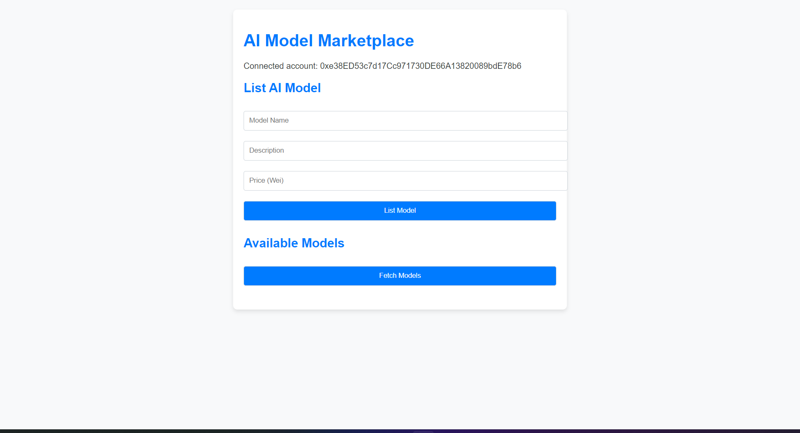
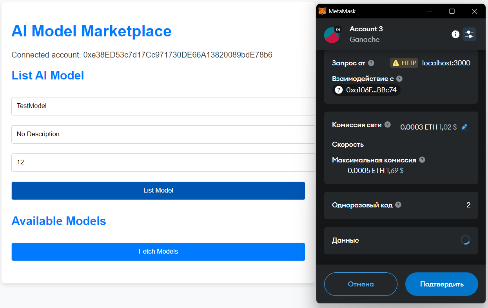

# AI Model Marketplace

The AI Model Marketplace is a decentralized application (dApp) built on Ethereum. It allows creators to list AI models for sale, and buyers can purchase and rate the models. This project uses Solidity for the smart contract and React for the frontend, with Web3.js to interact with the blockchain.

## Features

- **List AI Models:** Creators can list their AI models with a name, description, and price.
- **Purchase AI Models:** Buyers can purchase models by sending Ether.
- **Rate Models:** Buyers can rate the models they purchased.
- **Withdraw Funds:** Creators can withdraw funds earned from model sales.
- **MetaMask Integration:** Users interact with the blockchain via MetaMask.

## Project Structure

```
AI-MODEL-MARKETPLACE/
├── contracts/               # Solidity contracts
│   ├── AIModelMarketplace.sol
├── migrations/              # Deployment scripts
├── test/                    # Test files for smart contracts
├── client/                  # React frontend
│   ├── public/              # Static files (e.g., index.html)
│   ├── src/                 # Frontend source code
│   │   ├── App.js
│   │   ├── abi.js           # ABI of the smart contract
│   │   ├── App.css          # Styles
│   │   ├── index.js         # Main React entry point
│   ├── package.json         # Frontend dependencies
├── truffle-config.js        # Truffle configuration
├── README.md                # Project documentation
```

## Prerequisites

- Node.js (v16 or later)
- npm
- Truffle
- Ganache (optional for local testing)
- MetaMask (browser extension)

## Setup

### 1. Clone the repository
```bash
git clone https://github.com/your-repo/ai-model-marketplace.git
cd ai-model-marketplace
```

### 2. Install dependencies
#### Backend (Smart Contract)
```bash
npm install -g truffle
```

#### Frontend
Navigate to the `client` folder and install dependencies:
```bash
cd client
npm install
```

### 3. Compile the smart contract
Run the following command to compile the smart contract:
```bash
truffle compile
```

### 4. Deploy the smart contract
#### Local Network (Ganache):
1. Start Ganache.
2. Deploy the contract:
   ```bash
   truffle migrate --network development
   ```

#### Testnet (e.g., Goerli):
1. Configure `truffle-config.js` for the desired network.
2. Deploy the contract:
   ```bash
   truffle migrate --network goerli
   ```

### 5. Start the frontend
1. Navigate to the `client` folder:
   ```bash
   cd client
   ```
2. Start the React development server:
   ```bash
   npm start
   ```
3. Open `http://localhost:3000` in your browser.

## MetaMask Setup
1. Install MetaMask (https://metamask.io/).
2. Connect to the correct network (Ganache or a testnet like Goerli).
3. Import your account using the private key from Ganache or your wallet.

## Usage

### Listing a Model
1. Enter the model name, description, and price (in Wei).
2. Click "List Model."

### Purchasing a Model
1. Select a model from the list.
2. Click "Purchase Model" and confirm the transaction in MetaMask.

### Rating a Model
1. Enter the model ID and your rating (1-5).
2. Click "Rate Model."

### Withdrawing Funds
1. Click "Withdraw Funds."
2. Confirm the transaction in MetaMask.

## Smart Contract Details
The smart contract `AIModelMarketplace.sol` contains the following functions:

- `listModel(string memory name, string memory description, uint256 price)`
- `purchaseModel(uint256 modelId)`
- `rateModel(uint256 modelId, uint8 rating)`
- `withdrawFunds()`
- `getModelDetails(uint256 modelId)`

## Testing

To run tests for the smart contract:
```bash
truffle test
```

## Technologies Used

- Solidity
- Truffle
- Web3.js
- React
- MetaMask
- Ganache

## Troubleshooting

### Common Issues
- **MetaMask not connected:** Ensure MetaMask is installed and connected to the correct network.
- **Deployment issues:** Ensure the network configuration in `truffle-config.js` matches your environment.
- **React errors:** Ensure the frontend dependencies are installed with `npm install` in the `client` folder.

## License

This project is licensed under the MIT License. See the `LICENSE` file for details.

## Demo Screenshots

### Homepage


### Listing a Model

